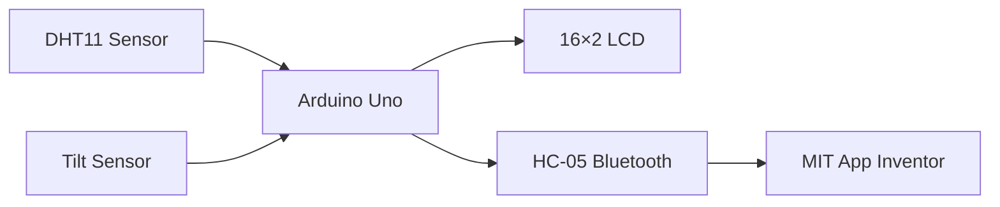

# THE WEATHER STATION

**Submitted by:**

- Imaan Soliman
- Jagriti Singh
- Jivitta Manivannan

**University of Northampton**  
Electronics and Computer Engineering  
Microprocessors and IoT  
**Deadline:** 26/01/2025, 23:59

---

# Objective

Design and implement an IoT weather monitoring system using an Arduino Uno R3 (ATmega328P) to acquire environmental data, display live readings on a 16×2 LCD, and transmit sensor data wirelessly over Bluetooth to a companion mobile application. The project demonstrates sensor interfacing, interrupt-driven event handling, and register-level embedded programming.

---

# Circuit Design

Tinkercad was used for schematic capture and to validate the wiring before assembling the physical board.

**Design 1 – IoT Weather Station**

🔗 https://www.tinkercad.com/things/3qoFuL57TnX-weather-station/editel?returnTo=https%3A%2F%2Fwww.tinkercad.com%2Fdashboard&sharecode=in1nwahO6V74P8WeY7kbg4A0KGtVcFlFicFTHH1g1W0

**Circuit Snapshot**


*Diagram 1 (Accessed: January 13, 2025)*

**Final Circuit**


*Diagram 2 (Accessed: January 13, 2025)*

---

# Hardware Components

- Arduino Uno R3 (ATmega328P)
- DHT11 temperature and humidity sensor
- Tilt sensor (earthquake detection)
- 16×2 LCD display
- HC-05 Bluetooth module
- Potentiometer (LCD contrast adjustment)

---

# Pin Assignment

| Function | Arduino Pin | Port | Notes |
|---|---|---|---|
| Tilt sensor | 2 | PD2 | INT0 external interrupt, internal pull-up enabled |
| LCD RS | 12 | PB4 | |
| LCD EN | 11 | PB3 | |
| LCD D4 | 5 | PD5 | |
| LCD D5 | 4 | PD4 | |
| LCD D6 | 3 | PD3 | |
| LCD D7 | 6 | PD6 | |
| HC-05 RX | 9 | PB1 | `SoftwareSerial` |
| HC-05 TX | 10 | PB2 | `SoftwareSerial` |
| DHT11 data | A1 | PC1 | |

The tilt sensor is placed on pin 2 because INT0 is hardwired to PD2 on the ATmega328P. The external interrupts INT0 and INT1 are available only on pins 2 and 3; no other pin can service them. The LCD data lines are arranged around this constraint.

---

# Firmware Overview

The firmware continuously acquires temperature and humidity measurements from the DHT11 sensor and calculates an approximate dew point. Sensor readings are displayed locally on the LCD while simultaneously being transmitted over Bluetooth for remote monitoring.

Earthquake detection is implemented using the ATmega328P's INT0 external interrupt. The interrupt service routine performs only minimal work, applying software debouncing and setting a volatile flag. All display updates, Bluetooth communication, and warning messages are handled within the main application loop, keeping the handler short and non-blocking.

---

# Low-Level AVR Implementation

Rather than relying entirely on Arduino's high-level abstractions, the digital input and interrupt peripherals are configured directly through AVR registers.

```c
DDRD  &= ~(1 << DDD2);      // PD2 as input
PORTD |=  (1 << PORTD2);    // enable internal pull-up
EICRA |=  (1 << ISC01);     // INT0 triggered on falling edge
EICRA &= ~(1 << ISC00);
EIMSK |=  (1 << INT0);      // unmask INT0
sei();                      // enable global interrupts
```

Implemented features include:

- Register-level digital I/O configuration using **DDRD** and **PORTD**
- Manual enabling of the internal pull-up resistor
- External interrupt configuration using **EICRA** and **EIMSK**
- Global interrupt enable using **sei()**
- Interrupt-driven earthquake detection
- Software debounce implemented within the interrupt service routine

---

# Bluetooth Communication

The HC-05 module streams live environmental data to the companion mobile application over a Bluetooth serial link.

Example data format:

```
Temperature:25C,Humidity:60%,Dew:17.00
```

Earthquake events are transmitted separately as:

```
Earthquake Warning!
```

---

# Mobile Application

## Development Platform

MIT App Inventor

The mobile application receives Bluetooth data from the Arduino and displays live environmental measurements.

### Features

- Bluetooth connection to HC-05
- Real-time temperature display
- Real-time humidity display
- Dew point display
- Earthquake warning notifications

---

## Data Flow



---

# Software Design

## Main Loop

The main application performs the following tasks:

1. Read temperature and humidity from the DHT11
2. Calculate dew point
3. Update the LCD display
4. Transmit sensor data over Bluetooth
5. Check for earthquake events flagged by the interrupt service routine

## Interrupt Handling

Earthquake detection is interrupt-driven using the ATmega328P's INT0 external interrupt.

```c
ISR(INT0_vect)
{
    unsigned long now = millis();

    if (now - lastInterrupt > 200)   // software debounce
    {
        earthquakeDetected = true;
        lastInterrupt = now;
    }
}
```

The interrupt service routine:

- Applies a 200 ms software debounce
- Sets a volatile event flag
- Returns immediately

All slower operations, including LCD updates and Bluetooth transmission, are deferred to the main loop.

---

# Debugging and Testing

Serial output was used as the primary debugging interface.

The firmware:

- Checks the return status of each DHT11 read and reports failures over the Serial Monitor, so a failed read is distinguishable from a bad value
- Uses the LCD as a secondary verification channel
- Confirms Bluetooth transmission by comparing the Serial Monitor output against the values received by the mobile application

---

# Known Limitation

The earthquake warning routine contains a blocking three-second delay while displaying the warning message. During this period sensor updates pause.

A future improvement would replace this blocking implementation with a non-blocking timer-driven state machine so that environmental monitoring and Bluetooth communication continue while the warning is active.

---

# Outcome

The completed system demonstrates:

- Register-level AVR programming
- Interrupt-driven embedded software
- Sensor interfacing
- Bluetooth communication
- Real-time environmental monitoring
- Embedded systems integration on the ATmega328P platform
